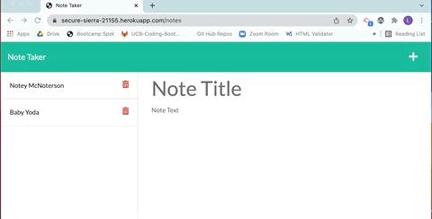

# ✍️ Note Taking App with Express.js
## Lauren Duker Darrimon
    
    
### Description
This note taking app uses an Express.js back end and allows the user to enter, save and delete notes. It saves and retrieve note data from user input into a JSON file, utilizing routing api calls for get, post and delete. The app is deployed to Heroku. 

### Table of Contents

* [Link](#link)
* [Installation](#installation)
* [Usage](#usage)
* [Questions](#questions)
* [License](#license)

### Link 
🔗 
Link to application [note-taker](https://secure-sierra-21155.herokuapp.com/)

### Installation
🔧
In order to build or modify this application for yourself, you need to install the following (dependencies): 
Node.js, express.js, and uniqid. 

~~~
npm install 
~~~

### Usage 
To run the application from the command line, run: 

~~~
node server.js
~~~

### Contributing 
✍️ 
Lauren Duker Darrimon is the author of the back end of this application. Find additional work on Lauren Duker Darrimon's [Github profile.](http://github.com/laurenDarrimon).

Follow these guildines for contributing to this project: 

### Questions
❓💌
Reach out to Lauren Duker Darrimon at hello@laurenlalita.com if you have any questions. 

### License
The license for this project is: [MIT](https://opensource.org/licenses/MIT)
